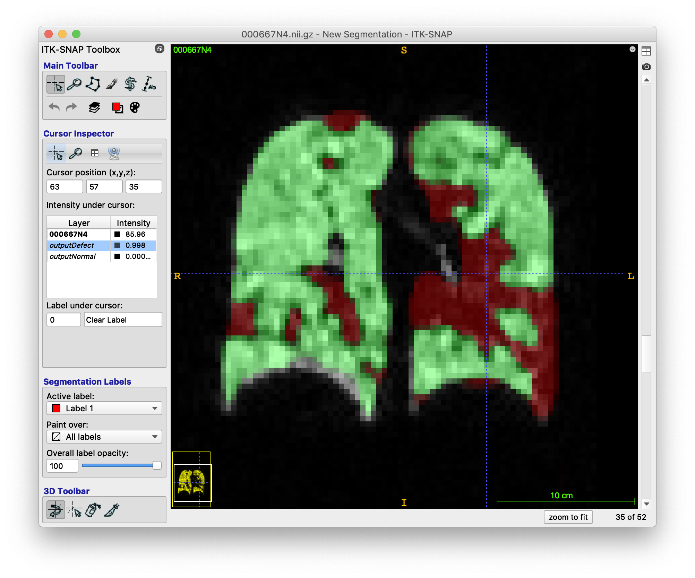

# App:  Functional MR lung segmentation

Deep learning app made for functional MRI lung slice-by-slice segmentation using ANTsRNet

## Citation

* Nicholas J. Tustison, Brian B. Avants, Zixuan Lin, Xue Feng, Nicholas Cullen, Jaime F. Mata, Lucia Flors, James C. Gee, Talissa A. Altes, John P. Mugler III, and Kun Qing.  Convolutional Neural Networks with Template-Based Data Augmentation for Functional Lung Image Quantification, _Academic Radiology_. [(pubmed)](https://www.ncbi.nlm.nih.gov/pubmed/30195415)

## Prerequisites

* [R](https://www.r-project.org) installation
* [ANTsR](https://github.com/ANTsX/ANTsR) installation
* [ANTsRNet](https://github.com/ANTsX/ANTsRNet) installation

## Model training notes

* Training data: Xenon-129 and He-3 ventilation MRI
* Unet model (see ``Scripts/Training/``).
* Template-based data augmentation

## Sample usage

```
#
#  Usage:
#    Rscript doSliceBySliceVentilationSegmentation.R inputImage inputLungMask outputPrefix
#

$ Rscript Scripts/doSliceBySliceVentilationSegmentation.R Data/Examples/000667N4.nii.gz Data/Examples/000667Mask.nii.gz output
Using TensorFlow backend.
Loading weights filetrying URL 'https://ndownloader.figshare.com/files/13824167'
Content type 'application/octet-stream' length 23843832 bytes (22.7 MB)
==================================================
downloaded 22.7 MB

2018-12-13 15:25:42.395870: I tensorflow/core/platform/cpu_feature_guard.cc:140] Your CPU supports instructions that this TensorFlow binary was not compiled to use: AVX2 FMA
  (elapsed time: 22.20554 seconds)
Reading  Data/Examples/000667N4.nii.gz  (elapsed time: 0.100543 seconds)
Prediction and decoding (slice-by-slice).  (elapsed time: 16.79772 seconds)
Writing output  (elapsed time: 0.581305 seconds)

Total elapsed time: 17.48219 seconds
```

## Sample results


